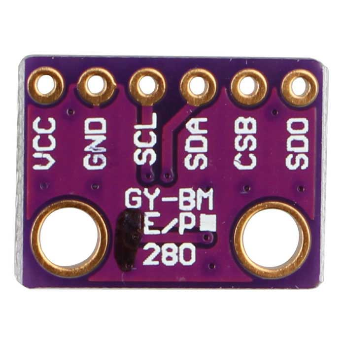
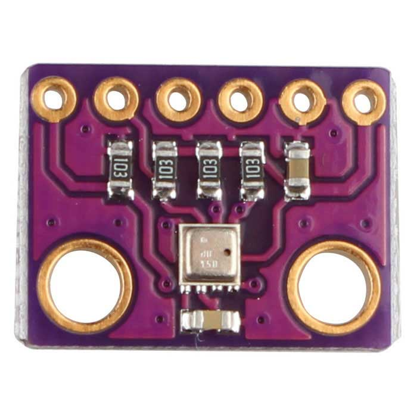

### Temperature, Humidity, and Pressure Sensor

The BME280 is a combined digital temperature, humidity, and pressure sensor. It comes in a small 2.5 mm x 2.5 mm package. A breakout board with the necessary pullup resistors and voltage translator ICs can be purchsed online at various places. I bought mine from Aliexpress.

[Link to buy](https://www.aliexpress.com/item/33052320902.html?spm=a2g0o.productlist.0.0.d96023892YdO9c&algo_pvid=8ee19218-7c1c-4fef-bfe3-3f53120eccb9&algo_expid=8ee19218-7c1c-4fef-bfe3-3f53120eccb9-1&btsid=225280c4-0977-47d0-8cf9-4e644d557fc9&ws_ab_test=searchweb0_0,searchweb201602_5,searchweb201603_52)

The sensor can be communicated via:
- Two Wire I2c
- 3 Wire SPI
- 4 Wire SPI

For this driver, I decided to go with I2C for a couple of reasons. **One**, it requires the least amount of wires and **Two**, even at I2C the device supports 3.4 MHz speed.

{:height="250px" width="250px"} {:height="250px" width="250px"}
